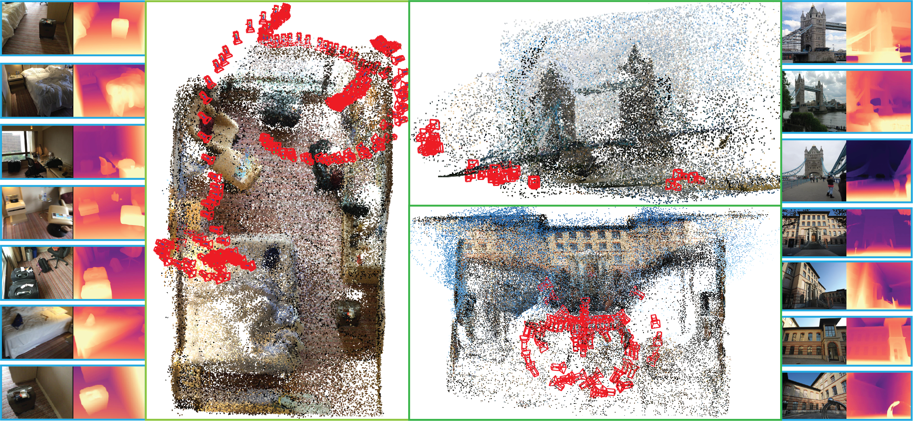
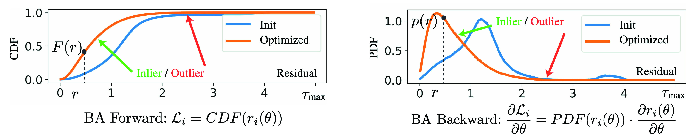
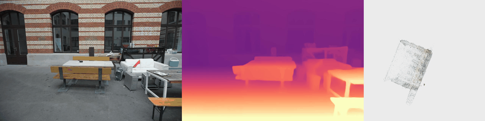

<div align="center">
<h1>Marginalized Bundle Adjustment: Multi-View Camera Pose from Monocular Depth Estimates</h1>

<a href="https://marginalized-ba.github.io/" target="_blank"></a>
<a href="https://arxiv.org/abs/XXXX.XXXXX"></a>
<a href="https://arxiv.org/pdf/XXXX.XXXXX.pdf"></a>

[Shengjie Zhu](https://shngjz.github.io/)<sup>1,2</sup>, [Ahmed Abdelkader](https://akader.netlify.app/)<sup>1</sup>, [Mark J. Matthews](https://www.markjmatthews.com/)<sup>1</sup>, [Xiaoming Liu](https://www.cse.msu.edu/~liuxm/index2.html)<sup>2</sup>, [Wen-Sheng Chu](https://l2ior.github.io/)<sup>1</sup>

<sup>1</sup>Google &nbsp;&nbsp; <sup>2</sup>Michigan State University

**3DV 2026**

</div>

## Abstract

<p align="center">
  
</p>

We introduce **Marginalized Bundle Adjustment (MBA)**, a bundle-adjustment objective tailored to monocular depth maps. **MBA** registers monocular depth maps into world coordinates, accounting for mono-depth maps' high variance with their density. **Excitingly, we show that monocular depth maps are already accurate enough to achieve state-of-the-art results on both small- and large-scale Structure-from-Motion and camera relocalization tasks.**

## Methodology

<p align="center">
  
</p>

**MBA** formulates the mono-depth's projective residual as an error distribution R={r}. Its forward function indexes the Cumulative-Distribution-Function (CDF) of the residual distribution R. Its backward function indexes the Probability-Distribution-Function (PDF) of the residual distribution R. The Bundle-Adjustment operates to maximize the Area-Under-the-Curve (AUC) of the CDF function.

## Qualitative Results

<p align="center">
  
</p>
<p align="center"><em>Structure-from-Motion on ETH3D — Courtyard</em></p>

## Installation

```bash
# Clone the repository
git clone https://github.com/ShngJZ/Marginalized-Bundle-Adjustment.git
cd Marginalized-Bundle-Adjustment
git submodule update --init --recursive --remote

# Create Conda environment
conda create -n mba python=3.10
conda activate mba

# Install PyTorch (https://pytorch.org/)
# Check and select the version compatible with your CUDA (check your CUDA version with nvcc --version)
pip install torch==2.6.0 torchvision==0.21.0 torchaudio==2.6.0 --index-url https://download.pytorch.org/whl/cu124

# Install dependencies for COLMAP baseline
cd third_party/Hierarchical-Localization/
python -m pip install -e .

# Verify hloc installation
python -c "from hloc import extract_features, match_features, reconstruction; print('hloc installed successfully')"

# Install remaining dependencies
cd ../../
pip install -r requirements.txt

# Install CuPy according to your CUDA version (for CUDA 12.x):
pip install cupy-cuda12x

# Download model checkpoints
mkdir -p modelzoo/ZoeDepth
wget https://github.com/isl-org/ZoeDepth/releases/download/v1.0/ZoeD_M12_NK.pt -P modelzoo/ZoeDepth
mkdir -p modelzoo/dust3r
wget https://download.europe.naverlabs.com/ComputerVision/DUSt3R/DUSt3R_ViTLarge_BaseDecoder_512_dpt.pth -P modelzoo/dust3r
```

## Quick Demo

To run with your own images, replace the ones in the custom data folder:

```bash
# Assume a server with 8 GPUs

# Preprocessing
CUDA_VISIBLE_DEVICES=0,1,2,3,4,5,6,7 python experiments/custom/preprocess.py \
    --data-root /home/ubuntu/disk6/Marginalized-Bundle-Adjustment-Datasets/custom \
    --output-location /home/ubuntu/disk6/Marginalized-Bundle-Adjustment/release/custom

# SfM
CUDA_VISIBLE_DEVICES=0,1,2,3,4,5,6,7 python experiments/custom/sfm.py \
    --data-root /home/ubuntu/disk6/Marginalized-Bundle-Adjustment-Datasets/custom \
    --output-location /home/ubuntu/disk6/Marginalized-Bundle-Adjustment/release/custom

# Visualization — generate PLY file and video
python experiments/custom/visualization.py \
    --data-root /home/ubuntu/disk6/Marginalized-Bundle-Adjustment-Datasets/custom \
    --output-location /home/ubuntu/disk6/Marginalized-Bundle-Adjustment/release/custom
```

## Dataset Download

Please ensure you agree to all licenses for each dataset before downloading.

```bash
mkdir Marginalized-Bundle-Adjustment-Datasets && cd Marginalized-Bundle-Adjustment-Datasets

# IMC2021
python -c "from huggingface_hub import snapshot_download; snapshot_download('shngjz/975921f0c7d37a4a5287de3c1e54fb09', repo_type='dataset', local_dir='imc2021', local_dir_use_symlinks=False)"

# ScanNet
python -c "from huggingface_hub import snapshot_download; snapshot_download('shngjz/f2509922c5dc01d3c0f9a365327c1de3', repo_type='dataset', local_dir='scannet', local_dir_use_symlinks=False)"

# ETH3D
python -c "from huggingface_hub import snapshot_download; snapshot_download('shngjz/e1a6043209bf56124cfa8fbe263cbcad', repo_type='dataset', local_dir='eth3d', local_dir_use_symlinks=False)"

# 7scenes
python -c "from huggingface_hub import snapshot_download; snapshot_download('shngjz/387f59dae75ae4507ce5501405966fa6', repo_type='dataset', local_dir='7scenes', local_dir_use_symlinks=False)"
cd 7scenes
chmod -R u+w .
for F in *.tar; do tar -xvf "$F"; done
rm *.tar
cd ..

# Wayspots 
mkdir wayspots && cd wayspots
wget https://storage.googleapis.com/niantic-lon-static/research/ace/wayspots.tar.gz
tar -xvf wayspots.tar.gz
rm wayspots.tar.gz

# Custom data
python -c "from huggingface_hub import snapshot_download; snapshot_download('shngjz/070374c783c4f2c8c14f7cf726d62e6e', repo_type='dataset', local_dir='custom', local_dir_use_symlinks=False)"
chmod -R u+w custom

# TNT_SAIL (Tanks and Temples + SAIL-VOS)
mkdir tnt_sail && cd tnt_sail
wget https://storage.googleapis.com/niantic-lon-static/research/acezero/colmap_raw.tar.gz
tar -xvf colmap_raw.tar.gz
rm colmap_raw.tar.gz
cd ..

# Fastmap_sfm data
python -c "from huggingface_hub import snapshot_download; snapshot_download('whc/fastmap_sfm', repo_type='dataset', local_dir='fastmap_sfm', local_dir_use_symlinks=False)"
cd fastmap_sfm
chmod -R u+w .
cd images
# Extract all .tar files recursively (root-level and inside subdirectories)
find . -name "*.tar" -type f | while read tarfile; do
    echo "Extracting: $tarfile"
    tar -xvf "$tarfile" -C "$(dirname "$tarfile")"
done
# Clean up .tar files after extraction
find . -name "*.tar" -type f -delete
cd ../..
```

## Experiments

Detailed instructions for each dataset benchmark:

| Dataset | Task | Guide |
|---------|------|-------|
| [ETH3D](experiments/eth3d/README.md) | Structure-from-Motion | Small-scale indoor/outdoor |
| [IMC2021](experiments/imc2021/README.md) | Structure-from-Motion | Photo-tourism landmarks |
| [ScanNet](experiments/scannet/README.md) | Structure-from-Motion | Indoor RGB-D scenes |
| [FastMap SfM & TNT-SAIL](experiments/fastmap_sfm/README.md) | Structure-from-Motion | Large-scale comparison |
| [7-Scenes](experiments/sevenscenes/README.md) | Camera Relocalization | Indoor relocalization |
| [Wayspots](experiments/wayspots/README.md) | Camera Relocalization | Outdoor relocalization |

## Citation

```bibtex
@inproceedings{zhu2026mba,
  title={Marginalized Bundle Adjustment: Multi-View Camera Pose from Monocular Depth Estimates},
  author={Zhu, Shengjie and Abdelkader, Ahmed and Matthews, Mark J. and Liu, Xiaoming and Chu, Wen-Sheng},
  booktitle={International Conference on 3D Vision (3DV)},
  year={2026}
}
```

## Acknowledgements

This project builds on several excellent open-source works including [DUSt3R](https://github.com/naver/dust3r), [ZoeDepth](https://github.com/isl-org/ZoeDepth), [UniDepth](https://github.com/lpiccinelli-eth/UniDepth), [RoMa](https://github.com/Parskatt/RoMa), [MASt3R](https://github.com/naver/mast3r), and [Hierarchical-Localization (hloc)](https://github.com/cvg/Hierarchical-Localization).